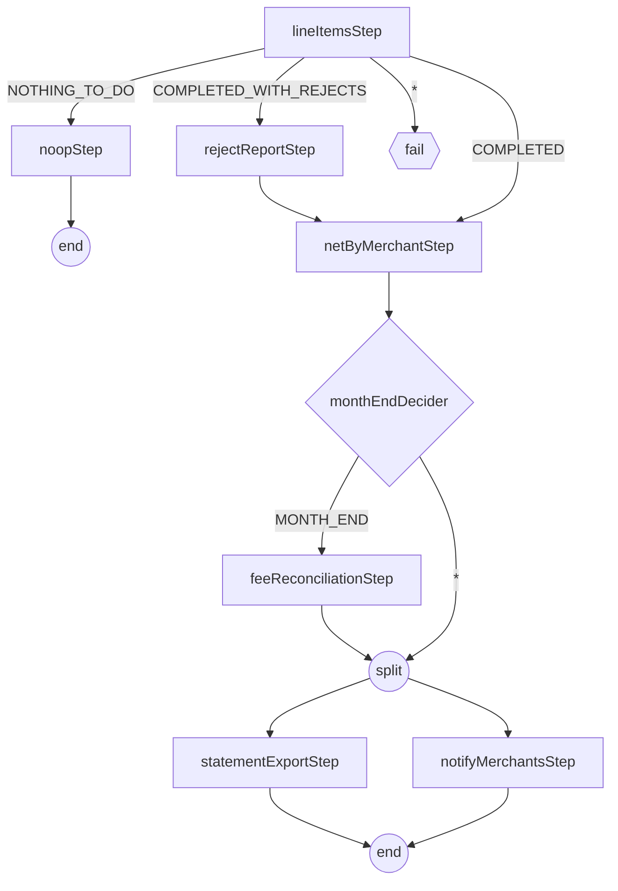

# Step 28 — jobs that branch, jobs that stop



## What a step says

A step finishes with two different words. `BatchStatus` is what Batch
itself observed - `COMPLETED`, `FAILED`, `STOPPED` - and a listener cannot
change it. `ExitStatus` is what the step *reports*, and a listener can
overwrite that report before the job graph reads it. `ClassifySettlementOutcome`
never touches whether `lineItemsStep` succeeded; it only relabels a
successful step's exit code so the next transition can tell a quiet day
from a normal one.

Four rules govern what happens next, and all four matter to this job:

- **Most specific pattern wins**, not first-declared-wins.
  `on("COMPLETED_WITH_REJECTS")` beats `on("*")` regardless of which one
  appears first in the builder.
- **An unmatched exit status fails the job.** `lineItemsStep`'s `on("*")`
  is not decoration - without it, an exit code nobody anticipated (a
  fifth outcome added later and forgotten here) would throw at runtime
  instead of failing the step where the mistake is obvious.
- **`end()`, `stop()`, and `fail()` are three different endings**, not
  three spellings of "done." `end()` marks the job instance complete -
  no restart. `fail()` leaves it restartable from the failed step.
  `stop()` ends the execution STOPPED and restartable - the right ending
  for a business condition that is not an error. This graph uses none;
  the STOPPED below arrives through the operator API instead.
- **Builder order is not execution order.** `netByMerchantStep` is wired
  before `monthEndDecider` in the source because Java needs a step
  reference to hand the decider, but nothing about that ordering says
  when the decider runs - the graph's `on()`/`to()` edges are the only
  thing that does.

## Which steps ran

```text
{{R: rejects}}
```

```text
{{R: clean}}
```

```text
{{R: empty}}
```

```text
{{R: month-end}}
```

## The value handed forward

`netByMerchantStep` and `notifyMerchantsStep` are two different steps with
two different `ExecutionContext`s; nothing written to one is visible in
the other unless something copies it. `ExecutionContextPromotionListener`
does that copy, one-way, step-to-job, and only after the step exits
successfully - a step that fails mid-write never promotes a half-finished
number. It is configured with exactly the keys this job needs
(`netTotalMinor`, `merchantCount`), not a wildcard: the job context is a
column on every `batch_job_execution_context` row for the life of the
instance, and promoting everything a step happens to compute would grow
that row for no reason anyone downstream reads.

```text
{{R: promoted}}
```

## Two flows at once

Before reaching for a split, the question is whether the two things
depend on each other's output. `statementExportStep` reads the day's
`settlement_line` rows; `notifyMerchantsStep` reads the promoted net
totals from the job context. Neither writes anything the other reads, so
there is nothing to order between them, which is exactly the condition a
split requires - Batch does not check for a hidden dependency, it just
runs both flows and if one needs the other's output first, the split
silently races.

`afterNetting` runs the two flows on separate virtual threads and joins
before `end`: the job cannot finish "half split," and a failure in either
flow fails the split node, not one thread quietly swallowed.

```text
{{R: split}}
```

## Two tables, no if

`ClassifierCompositeItemWriter` picks a delegate per item -
`settlement_line` for GBP, `settlement_line_fx` for everything else - by
classifier function, not by a branch inside a writer method. The two
tables share the V8 migration's DDL; only the destination differs.
`netByMerchantStep` reads a union of both, so the day's net total is
whole regardless of currency mix.

This is not the same shape as a `CompositeItemWriter`, which fans one
item out to *every* delegate. Two delegates on two different databases
would be exactly the dual-write step 10 built the outbox to avoid - a
second destination that needs to succeed atomically with the first
belongs in an outbox row, not a second writer call. Classifying which
single delegate an item goes to is a routing decision, not a dual write,
and V8 also moves `settlement_batch`'s primary key to
`(business_date, merchant_id, currency)` for the same reason: netting has
always grouped by currency, and only the seed data's merchant/currency
correlation kept two rows from colliding on the old key.

```text
{{R: routed}}
```

## Stop, not kill

Three ways a run can end besides `COMPLETED`, and they are not
interchangeable:

- **`kill -9`** leaves the execution `STARTED` with no end time - Batch
  cannot tell a dead process from a slow one, and refuses to restart it
  until `recover()` marks it `FAILED` (step 24).
- **SIGTERM**, given time, is graceful: the in-flight chunk finishes,
  the step commits, the execution ends in a consistent state. The k8s
  CronJob's `terminationGracePeriodSeconds: 120` and
  `spring.lifecycle.timeout-per-shutdown-phase=90s` exist so a pod being
  drained gets that time rather than being cut off mid-chunk.
- **`JobOperator.stop()`** is a request, not a signal. It sets a flag the
  chunk loop checks between chunks and the step ends `STOPPED` -
  restartable, same as a `FAILED` step, but recorded as asked-for rather
  than crashed. `POST /api/v1/batch/executions/{id}/stop` is this job's
  door into that flag; a tasklet that loops instead of chunking would
  need Batch 6's `StoppableStep` to see the same flag.

```text
{{R: stop}}
```

## Checkpoint

`perf/bench.sh step28`, against step 27's settled p50 414ms / p99 11782ms
(host stack, single-instance JVMs):

```text
{{R: bench}}
```
