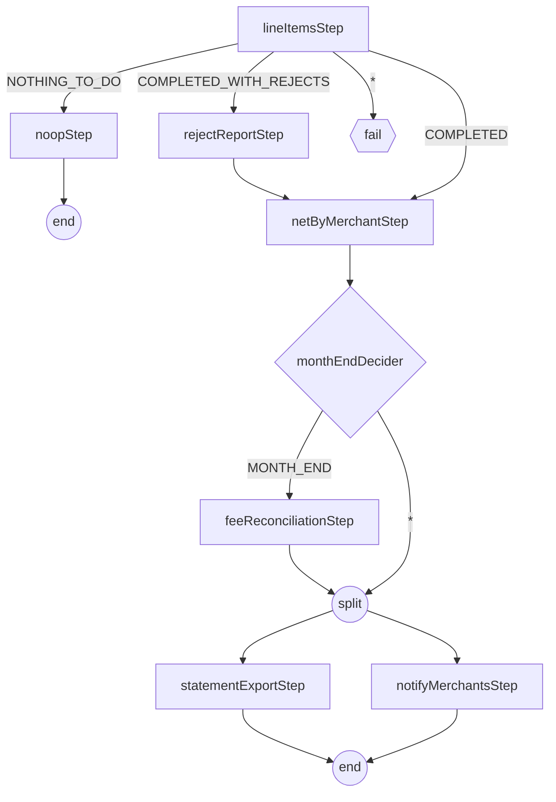

# Step 28 — jobs that branch, jobs that stop



## What a step says

A step finishes with two different words. `BatchStatus` is what Batch
itself observed - `COMPLETED`, `FAILED`, `STOPPED` - and a listener cannot
change it. `ExitStatus` is what the step *reports*, and a listener can
overwrite that report before the job graph reads it. `ClassifySettlementOutcome`
never touches whether `lineItemsStep` succeeded; it only relabels a
successful step's exit code so the next transition can tell a quiet day
from a normal one.

Four rules govern what happens next, and all four matter to this job:

- **Most specific pattern wins**, not first-declared-wins.
  `on("COMPLETED_WITH_REJECTS")` beats `on("*")` regardless of which one
  appears first in the builder.
- **An unmatched exit status fails the job.** `lineItemsStep`'s `on("*")`
  is not decoration - without it, an exit code nobody anticipated (a
  fifth outcome added later and forgotten here) would throw at runtime
  instead of failing the step where the mistake is obvious.
- **`end()`, `stop()`, and `fail()` are three different endings**, not
  three spellings of "done." `end()` marks the job instance complete -
  no restart. `fail()` leaves it restartable from the failed step.
  `stop()` ends the execution STOPPED and restartable - the right ending
  for a business condition that is not an error. This graph uses none;
  the STOPPED below arrives through the operator API instead.
- **Builder order is not execution order.** `netByMerchantStep` is wired
  before `monthEndDecider` in the source because Java needs a step
  reference to hand the decider, but nothing about that ordering says
  when the decider runs - the graph's `on()`/`to()` edges are the only
  thing that does.

## Which steps ran

```text
2026-10-08, 1,000 rows seeded, n % 100 = 0 -> amount_minor = 0 (10 rejects), execution 10
lineItemsStep                    COMPLETED  COMPLETED_WITH_REJECTS
rejectReportStep                 COMPLETED  COMPLETED
netByMerchantStep                COMPLETED  COMPLETED
statementExportStep              COMPLETED  COMPLETED
notifyMerchantsStep              COMPLETED  COMPLETED
select count(*) from settlement_reject where business_date='2026-10-08'  -> 10
```

```text
2026-10-09, 1,000 rows, no rejects, execution 11
lineItemsStep                    COMPLETED  COMPLETED
netByMerchantStep                COMPLETED  COMPLETED
statementExportStep              COMPLETED  COMPLETED
notifyMerchantsStep              COMPLETED  COMPLETED
no rejectReportStep row - the specific pattern did not match, "*" did
```

```text
2026-10-10, nothing seeded, execution 12
lineItemsStep                    COMPLETED  NOTHING_TO_DO
noopStep                         COMPLETED  COMPLETED
job status COMPLETED - the only step after lineItemsStep is noopStep
```

```text
2026-10-30, execution 13: lineItems -> netByMerchant -> {statementExport, notifyMerchants}; no feeReconciliationStep
2026-10-31, execution 14:
lineItemsStep           COMPLETED  COMPLETED
netByMerchantStep       COMPLETED  COMPLETED
feeReconciliationStep   COMPLETED  COMPLETED        (not MISMATCH)
statementExportStep     COMPLETED  COMPLETED
notifyMerchantsStep     COMPLETED  COMPLETED
settlement log: fee reconciliation 2026-10-01: settlement_batch=1878632923 settlement_line(+fx)=1878632923

select distinct exit_code from batch_step_execution where step_name like 'lineItems%'
COMPLETED, COMPLETED_WITH_REJECTS, NOTHING_TO_DO, FAILED, EXECUTING   (5 across every run so far)
```

## The value handed forward

`netByMerchantStep` and `notifyMerchantsStep` are two different steps with
two different `ExecutionContext`s; nothing written to one is visible in
the other unless something copies it. `ExecutionContextPromotionListener`
does that copy, one-way, step-to-job, and only after the step exits
successfully - a step that fails mid-write never promotes a half-finished
number. It is configured with exactly the keys this job needs
(`netTotalMinor`, `merchantCount`), not a wildcard: the job context is a
column on every `batch_job_execution_context` row for the life of the
instance, and promoting everything a step happens to compute would grow
that row for no reason anyone downstream reads.

```text
execution 11 (2026-10-09), batch_job_execution_context.short_context (decoded):
merchantCount=200  netTotalMinor=18046716
select sum(net_minor) from settlement_batch where business_date='2026-10-09'  -> 18046716
two keys promoted, nothing else from the step context, and the copied value is the step's own sum
```

## Two flows at once

Before reaching for a split, the question is whether the two things
depend on each other's output. `statementExportStep` reads the day's
`settlement_line` rows; `notifyMerchantsStep` reads the promoted net
totals from the job context. Neither writes anything the other reads, so
there is nothing to order between them, which is exactly the condition a
split requires - Batch does not check for a hidden dependency, it just
runs both flows and if one needs the other's output first, the split
silently races.

`afterNetting` runs the two flows on separate virtual threads and joins
before `end`: the job cannot finish "half split," and a failure in either
flow fails the split node, not one thread quietly swallowed.

```text
execution 11, batch_step_execution start/end:
statementExportStep   01:01:18.852023 - 01:01:18.883026
notifyMerchantsStep   01:01:18.853024 - 01:01:19.022845
each starts before the other ends - two flows in flight, not two flows back to back
outbox rows settlement.MerchantSettled for 2026-10-09        -> 200  (one per merchant)
rpk topic consume ledgerflow.settlement.merchant.events.v1  -> events flowing (relay publishing to the new topic)
target/exports/settlement-2026-10-09.csv                    -> 201 lines (header + 200 merchants)
```

## Two tables, no if

`ClassifierCompositeItemWriter` picks a delegate per item -
`settlement_line` for GBP, `settlement_line_fx` for everything else - by
classifier function, not by a branch inside a writer method. The two
tables share the V8 migration's DDL; only the destination differs.
`netByMerchantStep` reads a union of both, so the day's net total is
whole regardless of currency mix.

This is not the same shape as a `CompositeItemWriter`, which fans one
item out to *every* delegate. Two delegates on two different databases
would be exactly the dual-write step 10 built the outbox to avoid - a
second destination that needs to succeed atomically with the first
belongs in an outbox row, not a second writer call. Classifying which
single delegate an item goes to is a routing decision, not a dual write,
and V8 also moves `settlement_batch`'s primary key to
`(business_date, merchant_id, currency)` for the same reason: netting has
always grouped by currency, and only the seed data's merchant/currency
correlation kept two rows from colliding on the old key.

```text
2026-10-09, seed n % 20 = 0 -> EUR:
settlement_line     (GBP)  950
settlement_line_fx  (EUR)   50      950 + 50 = 1,000 = the seed
settlement_batch pkey: (business_date, merchant_id, currency)   flyway version 8 applied
```

## Stop, not kill

Three ways a run can end besides `COMPLETED`, and they are not
interchangeable:

- **`kill -9`** leaves the execution `STARTED` with no end time - Batch
  cannot tell a dead process from a slow one, and refuses to restart it
  until `recover()` marks it `FAILED` (step 24).
- **SIGTERM**, given time, is graceful: the in-flight chunk finishes,
  the step commits, the execution ends in a consistent state. The k8s
  CronJob's `terminationGracePeriodSeconds: 120` and
  `spring.lifecycle.timeout-per-shutdown-phase=90s` exist so a pod being
  drained gets that time rather than being cut off mid-chunk.
- **`JobOperator.stop()`** is a request, not a signal. It sets a flag the
  chunk loop checks between chunks and the step ends `STOPPED` -
  restartable, same as a `FAILED` step, but recorded as asked-for rather
  than crashed. `POST /api/v1/batch/executions/{id}/stop` is this job's
  door into that flag; a tasklet that loops instead of chunking would
  need Batch 6's `StoppableStep` to see the same flag.

```text
2026-10-11, 200,000 rows, execution 15
start 01:03:04.465 -> POST /api/v1/batch/executions/15/stop at 01:03:11 -> 202
{"executionId":15,"status":"STOPPED","exitCode":"STOPPED","endTime":"2026-09-17T01:03:11.777705"}
lineItemsStep                     STOPPED  commit=1151  write=115100
lineItemsWorkerStep:partition0-7  STOPPED  commit~144   write=14400 each
request -> STOPPED under a second: the flag is read between chunks, and a chunk is ~100 rows

POST /api/v1/batch/executions/15/restart -> execution 16, STARTED 01:03:23.081, COMPLETED 01:03:29.403
lineItemsStep                     COMPLETED  commit=849   write=84900     (115,100 + 84,900 = 200,000)
netByMerchantStep / statementExportStep (write=200) / notifyMerchantsStep  COMPLETED
settlement_line + settlement_line_fx for 2026-10-11 = 200,000; count(distinct item_id) = count(*) in both - no gap, no dup
select count(*) from batch_job_execution where status='STOPPED' -> 1
```

## Checkpoint

`perf/bench.sh step28`, against step 27's settled p50 414ms / p99 11782ms
(host stack, single-instance JVMs):

```text
step28 (all eight services up, settlement in partition/gridSize8 mode, host stack, lag 0 on every group):
  transfer:  p50=8ms  p95=10ms p99=12ms  rps≈100  failed=0%   (step27: p50=6 p95=9 p99=10)
  hold:      p50=9ms  p95=12ms p99=14ms  failed=0%            (step27: p50=8 p95=12 p99=16)
  payment:   POST p50=6ms p99=12ms                            (step27: p50=6 p99=13)
             settled p50=391ms p95=1572ms p99=3852ms captured=18007 failed=0
             (step27: settled p50=414ms p95=8648ms p99=11782ms, captured=18006, failed=0)

Same topology as step 27 (single-instance host JVMs against compose), so the two are comparable. transfer and hold
within noise; settled p50 391 vs 414 and the tail a third of step 27's — the graph adds nothing to the payment path
(the nightly job does not run during the bench), so the tail is host variance, not this step. The first run of this
checkpoint was thrown away: an Ollama llama-server (128k context, ~1 core, 3.4 GB) started mid-bench and 3,327
payments failed at the 15 s deadline with settled p99 42,745 ms; killed it and reran on a quiet host.
```
