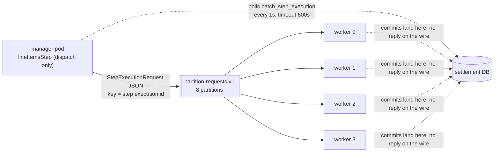

# Step 29 — workers on other machines



## Two roles, one image

One image, two profile documents at the bottom of `application.yml`. `manager` sets nothing but `ledgerflow.settlement.line-items: remote` — the name on the CronJob already says what the pod is for. `worker` sets the same `line-items: remote` plus two things off: `spring.kafka.listener.auto-startup: false` (no `CaptureCommandListener`, no membership in the `settlement-service` consumer group — step 26's 45-member rebalance-per-tick is the lesson this turns off by construction, not by discipline) and `spring.flyway.enabled: false` (both roles read and write Flyway-managed tables; only the manager, which is also the web Deployment, migrates them).

The worker keeps the web server. `SettlementServiceApplication.main` already exits any non-web context on purpose (step 25), and the base Deployment's probes are HTTP against `/actuator/health/{readiness,liveness}` — a worker with no web server would need its own probe shape, and there is nothing about dispatching partitions that needs one. `spring.batch.job.enabled` was already `false` from step 23; nothing here changes it.

## The instruction crosses the wire, the data does not

`StepExecutionRequest(stepName, stepExecutionId)` is the whole payload — two fields, no rows, no id range. A worker that receives one does exactly what `StepExecutionRequestHandler` does in-JVM: `jobRepository.getStepExecution(id)`, then `step.execute(it)`. Everything the partition needs — the `minId`/`maxId` `IdRangePartitioner` wrote into that execution's `ExecutionContext` — was already sitting in Postgres before the request was ever built; the topic only tells a worker which row to go read.

The first cut keyed each request by its step execution id (Batch 6's request carries no partition name) and let the producer hash it. Eight ids landed on five of the eight topic partitions, one of them carrying three, and a partition's requests run one after another on the one consumer thread that owns it: 2026-11-04 settled in three waves, 64.8 s against 25.4 s in-JVM. The request now names its partition — `stepExecutionId % gridSize`. One job's step executions come out of the splitter's loop with consecutive ids, so the modulo puts one on each partition; the key stays, for `rpk`.

```text
2026-11-04, key hashed (murmur2):  partitions 0,2,3,4 at 19:35:55.7 -> ~19:36:21
                                   partitions 1,5,7   at 19:36:21.3 -> ~19:36:41
                                   partition  6       at 19:36:41.4 -> 19:36:59.9     lineItemsStep 64.8 s
2026-11-06, partition = id % 8:    rpk topic consume ... -f '%k %p %v'
  40 0 {"stepName":"lineItemsWorkerStep","stepExecutionId":40}
  41 1 {"stepName":"lineItemsWorkerStep","stepExecutionId":41}
  ...
  47 7 {"stepName":"lineItemsWorkerStep","stepExecutionId":47}
  high watermark per partition +1 on all eight; one request = 55 bytes
```

## Eight partitions, four pods

`gridSize(8)` on the manager, `concurrency(2)` on each worker's listener container: 8 topic partitions, 4 pods, 2 consumer threads per pod. Each partition is still a full `StepExecution` row, same as in-JVM partitioning (step 27) — the difference is which JVM's core runs it.

```text
step27 (host, 8 cores, one JVM):    16.2s, 12358 items/sec
in-JVM partition, cluster:          25.4s,  7881 items/sec   8 partitions on one web pod (2026-11-02)
remote partition, 4 worker pods:    28.6s,  6983 items/sec   2 per pod, both nodes, starts within 13 ms (2026-11-06)
```

Four pods bought nothing, and the per-partition times say why: 25,000 items took 25-27 s whether eight partitions shared one JVM or two shared each of four, and 18-26 s when fewer ran at once on 11-04. That is roughly 1,000 items a second per partition, however many cores are behind it — one synchronous FX call to issuer-service per item, the ceiling step 27 named. Moving the loop to more machines moves the wait with it. The remote run is 3 s slower on top: half a second is the manager noticing (the last partition finished at 19:45:48.9, its poll saw it at 49.4), the rest is each partition taking 27.5 s instead of 25.2 s — not traced further.

## Polling, not replies

The manager never opens an inbound channel for a reply. `RemotePartitioningManagerStepBuilder` has no `inputChannel` — it polls `batch_step_execution` (`pollInterval(1000)`, `timeout(600_000)`) until every dispatched partition's row says `COMPLETED`, the same table step 24's restart already reads. That means a worker that dies without replying cannot hang the manager: the poll is watching a row in Postgres, not a pod. `ClassifySettlementOutcome`, the listener that turns a day's outcome into an exit status (step 28), stays exactly where it was — on the manager step, reading the aggregate the poll already assembled — because from the manager's side a remote partition and an in-JVM one finish the same way.

## A worker dies

`kubectl delete pod --grace-period=0 --force`, mid-partition (step 26's machine-died shape, this time on a worker). The in-flight chunk rolls back at Postgres — nothing partial lands — and the offset for that partition's request was never committed, because `AckMode.RECORD` only commits after the request finishes. The step execution stays `STARTED`, its `read.count` sitting at the last chunk it actually committed.

For `session.timeout.ms` (30s, step 19's static membership — the wait is the lesson, the knob is unchanged) nothing happens: the broker doesn't know the member is gone yet. Once it does, it moves the dead member's topic partitions to another consumer, which gets the same request redelivered. `StepExecutionRequestHandler` runs `step.execute` on the same `STARTED` row; the paging reader restarts after the last key it committed (`start.after`, not a `jumpToItem` count) and finishes the day from there.

Two things went differently from the plan. The force-deleted pod kept committing for three seconds — `--grace-period=0 --force` removes the API object at once, the kubelet kills the container when it gets to it — so the resume point is 8,000, not the 5,900 in the snapshot. And the orphans were not picked up by a survivor: the Deployment had already started a replacement, and cooperative-sticky handed the two freed topic partitions to the one member holding none.

There's a second net for a request that never comes back at all: the manager's own `timeout(600_000)` fires, `lineItemsStep` goes `FAILED`, the job goes `FAILED`, and a restart re-dispatches every partition whose last execution isn't `COMPLETED` — `SimpleStepExecutionSplitter.shouldStart` only refuses `UNKNOWN`, so a `STARTED` orphan re-runs from its own context rather than being skipped.

```text
2026-11-01, 200,000 items
19:48:47.251  8 worker rows STARTED
19:48:52.399  kubectl delete pod settlement-worker-...-8djng --grace-period=0 --force   (partitions 3 and 4)
19:48:52.718  snapshot: all 8 STARTED, read_count 5900-6000
              partition3 short_context: minId=875001 maxId=900000 read.count=6200 start.after={id=881200}
19:48:55.57   last commit from the dead pod: partitions 3 and 4 at 8000
19:49:12      the six survivors COMPLETED, 25000 each
19:49:22.889  replacement pod ...-xdptp: Executing step: [lineItemsWorkerStep:partition4], [...partition3]
              same step_execution_id 56 / 57, start_time moved 19:48:46.12 -> 19:49:22.889, read_count 8000 -> 10100
19:49:37.55   both COMPLETED at 25000 (commit_count 250 = 80 before + 170 after)
              quiet 27.3 s after the last commit; lineItemsStep 51.7 s (28.6 clean + the stall + a 15 s tail)
path: Kafka redelivery onto the same STARTED row; the manager's 10-min timeout never fired
settlement_item NEW = 0; settlement_line 190000 + line_fx 10000 = 200000; count(*) - count(distinct item_id) = 0
settlement-worker 4/4 again (new pod), group Stable, 8 members, lag 0
```

## The other shape

Remote partitioning still has one JVM doing the reading, processing and writing per partition — it just runs somewhere else. Remote chunking splits that loop itself across the wire: the manager reads (`pagingItemReader`), ships each chunk of 100 items to a worker to process and write, and waits for a reply. It runs as its own job, `lineItemsChunkingJob`, once, on demand — never in the nightly graph, because the tradeoff below isn't worth paying every night.

The payloads are JDK-serialised, not JSON: a `ChunkRequest` carries a `StepContribution` → `StepExecution` graph that doesn't have a stable JSON shape, and it has no no-arg constructor either — that graph riding along on every chunk, not just once per partition, is most of what this shape costs over the one above. The producer and consumer are built inline from `KafkaProperties`, not as beans, because Boot's own `KafkaTemplate`/`ConsumerFactory`/`ProducerFactory` are `@ConditionalOnMissingBean` — a second bean of either type would back them off and take the outbox publisher and every listener in the service down with them.

One partition dispatch per range regardless of how many rows are in it; one chunk-request-and-reply pair per 100 items. On 1,000 rows that's 8 partition dispatches against 10 chunks × 2 messages = 20; scaled to 200,000 rows (chunk size unchanged) it's still 8 against 2,000 × 2 = 4,000.

```text
2026-11-05, 1,000 items, lineItemsChunkingJob: COMPLETED in 0.725 s
chunk-requests  high watermark 0 -> 10      chunk-replies 0 -> 10      partition-requests unchanged
one chunk request (100 items)  12,905 bytes JDK-serialised: ChunkRequest, Chunk, StepContribution, StepExecution,
                                JobInstance, JobParameters, ExecutionContext, TaskletStep, ... and the items
one chunk reply                 5,192 bytes
one partition request              55 bytes JSON
settlement_line 950 + line_fx 50 = 1,000; lineItemsChunkingStep write_count = 2,000 (counted once on each side of the wire)
200,000 rows: 4,000 messages and ~36 MB on the wire, against 8 messages and 440 bytes
```

A chunk request is 235 times a partition request, and most of it is the step's own bookkeeping, not the hundred items.

## Found on the way

The cluster found five things the host never did.

- **Every topic at one partition.** `k8s-up.sh` ran both `topics.sh` passes after the services, Redpanda auto-creates a topic for the first client that asks, and `topics.sh`'s create is a no-op after that — 12 of the 15 main topics (`partition-requests.v1` among them) and 44 of 48 retry topics came up with one partition (step 26 measured on three). Fixed live with `rpk topic add-partitions` on the empty topics; the script now applies Redpanda first and creates the topics before any client exists.
- **The nightly job failed at the statement export in every container.** The Paketo run user can't write `/workspace`; step 28 put the export into the nightly graph, and `target/exports` only works on the host. `SETTLEMENT_BATCH_EXPORTDIR=/tmp/exports` in the cluster and compose env.
- **The recover cron recovered a live run.** `recover-stranded` treated every `STARTED` execution as dead; the `*/10` tick landed three seconds into 2026-11-03, marked the manager step and one partition `FAILED`, the manager's last save lost the version race and the execution ended `UNKNOWN` — which Batch refuses to restart. Now only a run quiet for longer than the manager's 10-minute timeout counts as stranded.
- **`RemoteWorkersIT`'s chunks went to the cluster.** The byte[] clients were built from `KafkaProperties`, which never sees a test's `@ServiceConnection`, so they connected to `localhost:9092` — the kind cluster's broker — and its four chunk workers took the work (50 rows landed in the cluster's `settlement_line` under a test date, since removed). They now copy Boot's own factory config.
- **The end-of-day split loses a branch.** Batch 6 runs `createStepExecution` under SERIALIZABLE, and export and notify create theirs at the same instant; Postgres cancelled one in all three manager runs (`could not serialize access due to read/write dependencies`). The CronJob's retry restarts the job and only the lost branch runs, so every day finished — but not on the first attempt. Not fixed here: lowering the create isolation would weaken the already-running guard step 23 relies on.

## What it costs

Four workers at 768Mi each, a topic and a consumer group that didn't exist before, a second profile document to keep in sync with the first, 30 seconds of stall on every worker pod that dies, a hard ceiling at `max.poll.interval.ms` past which a still-running partition gets its request redelivered out from under it (safe only because the writer is `on conflict do nothing`), one chunking manager at a time by construction (`@Profile("manager")` on the replies consumer — a second manager JVM would eat the first's replies), and a `stop()` that only the manager sees — a worker mid-partition has no flag to check.

## Checkpoint

`perf/bench.sh step29`, against step 26's settled p50 243ms / p99 378ms (cluster, two replicas of every service) — the same topology, so the two are comparable. Step 28's 391ms/3852ms is quoted above for the host stack, not compared: it's a different machine shape.

```text
perf/bench.sh step29 (PSQL="kubectl exec deploy/postgres -- psql"), commit bfb49f4-dirty, k6 on the host through the
NodePorts, on a cluster k8s-up.sh had built from nothing 5 minutes earlier (871 s; 24 pods Ready, 9 groups Stable, lag 0):

scenario   load            p50    p95    p99      failed
transfer   100/s for 60s   4ms    8ms    51ms     0%        (step 26: 4 / 7 / 22)
holds      50/s for 30s    9ms    642ms  2263ms   0%        (step 26: 9 / 64 / 1261)
payments   100/s for 180s  6ms    9ms    14ms     0%        (step 26: 5 / 8 / 12)
settled                    247ms  323ms  360ms    captured 18005, failed 0     (step 26: 243 / 331 / 378)

The holds p99 is the same cold JIT step 26 hit, worse for pods younger still: max 2.6 s, 39 iterations
dropped at 50/s. The same scenario again on the same pods, warm (perf/run.sh holds warm29): p50 7ms,
p95 10ms, p99 13ms (step 26 warm: 7 / 10 / 12).
```

## Kept / Not kept

Kept: the polling manager over an aggregation channel — a worker that never replies still can't hang the day, and it's one topic instead of two. JDK serialisation for chunk requests only, not for partition requests — the partition wire only ever needed two fields, and JSON is enough for that. The worker Deployment as a fourth kind of resource next to the eight service overlays (step 26's own rule: a service gets a name, an image and a database URL; a worker gets a role instead of a database).

Not kept: remote chunking in the nightly graph — the serialised `StepContribution` graph on every 100-item chunk is a cost step 27 already priced against the FX call actually holding the ceiling, and buying it nightly would be paying for a rung this project doesn't need yet.
