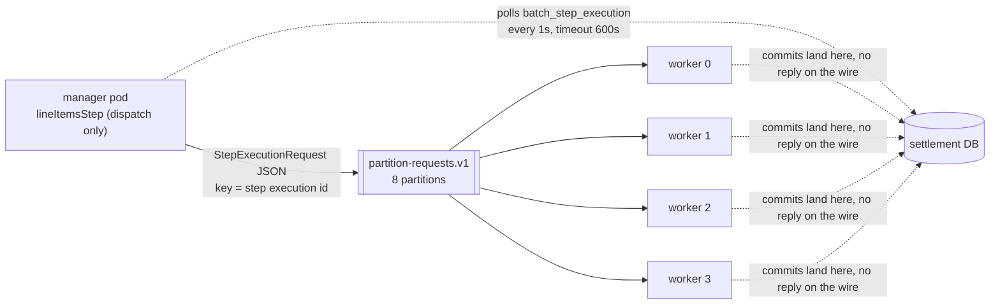

# Step 29 — workers on other machines



## Two roles, one image

One image, two profile documents at the bottom of `application.yml`. `manager` sets nothing but `ledgerflow.settlement.line-items: remote` — the name on the CronJob already says what the pod is for. `worker` sets the same `line-items: remote` plus two things off: `spring.kafka.listener.auto-startup: false` (no `CaptureCommandListener`, no membership in the `settlement-service` consumer group — step 26's 45-member rebalance-per-tick is the lesson this turns off by construction, not by discipline) and `spring.flyway.enabled: false` (both roles read and write Flyway-managed tables; only the manager, which is also the web Deployment, migrates them).

The worker keeps the web server. `SettlementServiceApplication.main` already exits any non-web context on purpose (step 25), and the base Deployment's probes are HTTP against `/actuator/health/{readiness,liveness}` — a worker with no web server would need its own probe shape, and there is nothing about dispatching partitions that needs one. `spring.batch.job.enabled` was already `false` from step 23; nothing here changes it.

## The instruction crosses the wire, the data does not

`StepExecutionRequest(stepName, stepExecutionId)` is the whole payload — two fields, no rows, no id range. A worker that receives one does exactly what `StepExecutionRequestHandler` does in-JVM: `jobRepository.getStepExecution(id)`, then `step.execute(it)`. Everything the partition needs — the `minId`/`maxId` `IdRangePartitioner` wrote into that execution's `ExecutionContext` — was already sitting in Postgres before the request was ever built; the topic only tells a worker which row to go read. Keyed by the step execution id (Batch 6's request carries no partition name), so eight ids hash across eight partitions — a spread, not a 1:1 assignment, and nothing here guarantees one id per partition either.

```text
{{R: requests}}
```

## Eight partitions, four pods

`gridSize(8)` on the manager, `concurrency(2)` on each worker's listener container: 8 topic partitions, 4 pods, 2 consumer threads per pod. Each partition is still a full `StepExecution` row, same as in-JVM partitioning (step 27) — the difference is which JVM's core runs it.

```text
step27 (host, 8 cores, one JVM):    16.2s, 12358 items/sec
in-JVM partition, cluster:          {{R: in-jvm}}
remote partition, 4 worker pods:    {{R: remote}}
```

## Polling, not replies

The manager never opens an inbound channel for a reply. `RemotePartitioningManagerStepBuilder` has no `inputChannel` — it polls `batch_step_execution` (`pollInterval(1000)`, `timeout(600_000)`) until every dispatched partition's row says `COMPLETED`, the same table step 24's restart already reads. That means a worker that dies without replying cannot hang the manager: the poll is watching a row in Postgres, not a pod. `ClassifySettlementOutcome`, the listener that turns a day's outcome into an exit status (step 28), stays exactly where it was — on the manager step, reading the aggregate the poll already assembled — because from the manager's side a remote partition and an in-JVM one finish the same way.

## A worker dies

`kubectl delete pod --grace-period=0 --force`, mid-partition (step 26's machine-died shape, this time on a worker). The in-flight chunk rolls back at Postgres — nothing partial lands — and the offset for that partition's request was never committed, because `AckMode.RECORD` only commits after the request finishes. The step execution stays `STARTED`, its `read.count` sitting at the last chunk it actually committed.

For `session.timeout.ms` (30s, step 19's static membership — the wait is the lesson, the knob is unchanged) nothing happens: the broker doesn't know the member is gone yet. Once it does, it moves the dead member's topic partitions to a surviving consumer, which gets the same request redelivered. `StepExecutionRequestHandler` runs `step.execute` on the same `STARTED` row; the reader `jumpToItem`s to the saved position and finishes the day from there.

There's a second net for a request that never comes back at all: the manager's own `timeout(600_000)` fires, `lineItemsStep` goes `FAILED`, the job goes `FAILED`, and a restart re-dispatches every partition whose last execution isn't `COMPLETED` — `SimpleStepExecutionSplitter.shouldStart` only refuses `UNKNOWN`, so a `STARTED` orphan re-runs from its own context rather than being skipped.

```text
{{R: kill}}
```

## The other shape

Remote partitioning still has one JVM doing the reading, processing and writing per partition — it just runs somewhere else. Remote chunking splits that loop itself across the wire: the manager reads (`pagingItemReader`), ships each chunk of 100 items to a worker to process and write, and waits for a reply. It runs as its own job, `lineItemsChunkingJob`, once, on demand — never in the nightly graph, because the tradeoff below isn't worth paying every night.

The payloads are JDK-serialised, not JSON: a `ChunkRequest` carries a `StepContribution` → `StepExecution` graph that doesn't have a stable JSON shape, and it has no no-arg constructor either — that graph riding along on every chunk, not just once per partition, is most of what this shape costs over the one above. The producer and consumer are built inline from `KafkaProperties`, not as beans, because Boot's own `KafkaTemplate`/`ConsumerFactory`/`ProducerFactory` are `@ConditionalOnMissingBean` — a second bean of either type would back them off and take the outbox publisher and every listener in the service down with them.

One partition dispatch per range regardless of how many rows are in it; one chunk-request-and-reply pair per 100 items. On 1,000 rows that's 8 partition dispatches against 10 chunks × 2 messages = 20; scaled to 200,000 rows (chunk size unchanged) it's still 8 against 2,000 × 2 = 4,000.

```text
{{R: chunking}}
```

## What it costs

Four workers at 768Mi each, a topic and a consumer group that didn't exist before, a second profile document to keep in sync with the first, 30 seconds of stall on every worker pod that dies, a hard ceiling at `max.poll.interval.ms` past which a still-running partition gets its request redelivered out from under it (safe only because the writer is `on conflict do nothing`), one chunking manager at a time by construction (`@Profile("manager")` on the replies consumer — a second manager JVM would eat the first's replies), and a `stop()` that only the manager sees — a worker mid-partition has no flag to check.

## Checkpoint

`perf/bench.sh step29`, against step 26's settled p50 243ms / p99 378ms (cluster, two replicas of every service) — the same topology, so the two are comparable. Step 28's 391ms/3852ms is quoted above for the host stack, not compared: it's a different machine shape.

```text
{{R: bench}}
```

## Kept / Not kept

Kept: the polling manager over an aggregation channel — a worker that never replies still can't hang the day, and it's one topic instead of two. JDK serialisation for chunk requests only, not for partition requests — the partition wire only ever needed two fields, and JSON is enough for that. The worker Deployment as a fourth kind of resource next to the eight service overlays (step 26's own rule: a service gets a name, an image and a database URL; a worker gets a role instead of a database).

Not kept: remote chunking in the nightly graph — the serialised `StepContribution` graph on every 100-item chunk is a cost step 27 already priced against the FX call actually holding the ceiling, and buying it nightly would be paying for a rung this project doesn't need yet.
