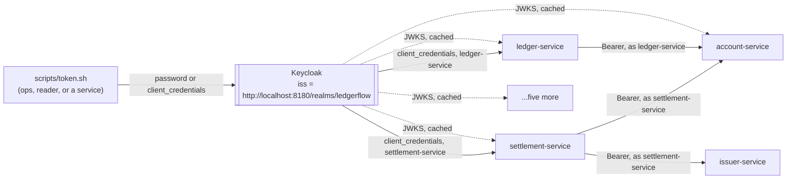

# Step 31 — Nobody gets in without a token

## The realm

{{R: one paragraph - the realm file, its two roles, three clients, four users; why password grant only for the CLI/dev users and only client_credentials for the two services}}

## A door, closed

{{R: doors - a curl with no Authorization header against every /api route, 401; the same request with a reader token against a write endpoint, 403; health still open; the check that proves it (TransferControllerTest's three cases)}}

## The rule travels with the method

{{R: @PreAuthorize on PostTransfer.transfer, and where it sits relative to the concurrency limiter - which one runs first and why that order matters}}

## A service with a name

{{R: kafka path - ledger's PlaceHold listener minting its own token off the request thread, cached, no HttpServletRequest to hang a manager off}}

{{R: batch path - settlement's manager profile calling issuer for FX with its own client credentials, same interceptor, off a Spring Batch tasklet thread}}

## Where the cost is not

{{R: bench - perf/bench.sh step31 against step 29's 51 / 13 / 14 / 247-360; the compare.sh verdict; what a JWT validation adds to a request that a JWK set already cached}}

## The bulkhead

{{R: race - perf/race.sh's 50 concurrent debits still land at exactly one wallet balance, now behind a token and a @ConcurrencyLimit(10)}}

## The same string, or nothing works

KC_HOSTNAME pins the issuer to `http://localhost:8180` for every token Keycloak mints, whether the caller reached it through `localhost:8180` or a pod reached it through `keycloak:8080` — the two URLs never have to agree on more than that one string. The alternative production draws is an Ingress with one real hostname for both paths; not built here, because there is no Ingress controller in this cluster yet and the string-match already proves the mechanism.

## Kept / Not kept

Kept: no revocation (5-minute tokens are the only expiry this project buys), password grant for `ledgerflow-cli` as a dev-only convenience, client credentials cached per registration rather than fetched per call.

Not kept: retrying a token-endpoint failure. `OAuth2AuthorizationException` doesn't match `AccountRetries`' `transientOnly` predicate, so a Keycloak blip during the 5-minute cache window has no fallback beyond the cached token running out - the same gap the decisions file named going in.
