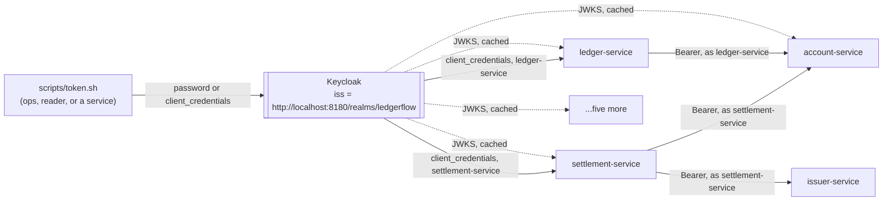

# Step 31 — Nobody gets in without a token

## The realm

`infra/compose/keycloak/ledgerflow-realm.json` is the whole realm: two roles (`ledger-write`, `account-read`), three clients (`ledgerflow-cli` public with `directAccessGrantsEnabled`, `ledger-service` and `settlement-service` confidential with `serviceAccountsEnabled`), four users (`ops` with both roles, `reader` with `account-read` only, and the two `service-account-*` users Keycloak creates one per service client). Password grant only exists on `ledgerflow-cli` — a human at a terminal has a password and nothing else to hand over, and `directAccessGrantsEnabled` is the only flag that lets `scripts/token.sh` post one. The two services never see a password: `client_credentials` is a secret two processes already share (the `oidc-clients` Kubernetes Secret), and it mints a token with no human on the other end, which is what a Kafka listener or a batch tasklet actually is.

## A door, closed

A bare curl (no `Authorization` header) against every service's `/api` route answers 401: account's `/api/v1/accounts`, ledger's `POST /api/v1/holds`, balance's `/api/v1/balances/...`, risk's `/api/v1/cases`, payment's `/api/v1/payments/x`, issuer's `/api/v1/fx/GBP`, settlement's `/api/v1/batch/jobs`, notification's `/actuator/metrics` — eight for eight. `/v3/api-docs` and `/actuator/metrics` need a token too now, same 401. `POST /api/v1/transfers` with the `reader` token (`account-read`, no `ledger-write`) against A-1/A-2 answers 403 — the same account that reads fine (`GET /api/v1/accounts` -> 200) can't write. `/actuator/health` and `/actuator/health/readiness` answer 200 on every service whether or not a token is attached — probes never needed to change. `TransferControllerTest`'s three cases prove the same shape without a running Keycloak: `noTokenIsA401` under `@WithAnonymousUser`, `aReaderCannotMoveMoney` at 403 via a mock `account-read` JWT, `ledgerWriteGetsThrough` at 201.

## The rule travels with the method

`@PreAuthorize("hasRole('ledger-write')")` sits directly above `@ConcurrencyLimit(10)` on `PostTransfer.transfer`, and that's also the order the two proxies run in: Spring's method-security advisor takes highest precedence by default, so the role check happens before the bulkhead's semaphore is even touched. The order matters under load — a reader hammering `/api/v1/transfers` (the reader leg of `perf/race.sh`, 50 concurrent) gets rejected at the door and never occupies one of the ten concurrent slots a legitimate `ops` caller would otherwise queue behind. Authorization is cheaper than a transaction, and it runs first for exactly that reason.

## A service with a name

Ledger's `PlaceHold` listener runs on a Kafka consumer thread, not a request thread — there is no `HttpServletRequest` for `DefaultOAuth2AuthorizedClientManager` to hang an authorized client off, which is why `AccountClientConfig` uses `AuthorizedClientServiceOAuth2AuthorizedClientManager` instead: one client-credentials token per registration (`ledger-service`), minted on first use and cached in `OAuth2AuthorizedClientService` until it's close to expiry. `scripts/scenario-authorize-capture.sh` and `scenario-insufficient-funds.sh` both exercise this path end to end (Requested -> CapturePending -> Captured/Failed) with no code on either side aware that a token even exists.

Settlement calls issuer-service for FX from Spring Batch chunk threads, on the web pod in-JVM and on the worker pods when the CronJob runs remote — same story, same interceptor, a different registration (`settlement-service`, exposed as the `serviceBearer` bean and injected straight into `FxRateGateway`'s constructor). Seeding 1,000 items for 2026-11-07 (700 GBP, 300 EUR) and running `nightlySettlementJob` through `POST /api/v1/batch/jobs/nightlySettlementJob` proved it live: `settlement_line + settlement_line_fx = 1,000`, and the 300-row `settlement_line_fx` count only happens if every EUR item's FX call actually cleared issuer-service's resource-server filter with a valid `settlement-service` token. The CronJob path, the one with no web server at all, got the same test: 2026-11-08 (a copy of 11-07) from `kubectl create job --from=cronjob/nightly-settlement` — eight `lineItemsWorkerStep` partitions COMPLETED on the four worker pods, 700 + 300 = 1,000, so each worker minted its own token off any request thread. Its first attempt died on step 29's open end-of-day split conflict (`could not serialize access`, in `notifyMerchantsFlow`) and the Job's retry finished the day — not auth; no 401 or 403 in either pod.

## Where the cost is not

`perf/bench.sh step31` against step 29's cluster rows: transfer p99 51ms -> **28ms**, holds warm p99 13ms -> **18ms**, payments p99 14ms -> **22ms**, settled p50/p99 247/360ms -> **260/472ms**. `perf/compare.sh docs/perf/transfer-step29.json docs/perf/transfer-step31.json 10` exits 0 (-44.8% on p99 — noise in the same direction as steps 26->29's own 22->51 swing at flat p50, not a regression). A JWT check against an already-fetched, cached JWK set is a local RS256 signature verification plus an issuer-string compare — no network call per request, no Keycloak round trip — and it doesn't show up here: every number this step measured sits within the run-to-run noise this suite has always had. The transfer scenario did show `http_req_failed=3.5%`, but every one of those was a business-level 422 (`InsufficientFundsException`) from wallets `scenario-fraud-flagged.sh` had just emptied — its burst captures 2 x 5,000 from each wallet it rotates through, two minutes before the bench, and the transfer scenario moves 1 minor between random wallets, so those wallets refused until the random walk paid them back (20% of the warm-up's requests, 2.7% of the main phase's), not a 401/403 from the new security layer — ruled out by grepping account-service's and Keycloak's logs for the run window, both clean.

## The bulkhead

`perf/race.sh` with the `ops` token: A-20 reset to 10000 minor, 50 concurrent 8000-minor transfers fired at it, exactly **1 created** (the correct answer), balance settles at **2000** — never below zero. The `@PreAuthorize` check runs first for all 50, then `@ConcurrencyLimit(10)` queues the ones past ten at a time, then the row-lock UPDATE in `PostTransfer.transfer` decides which single one actually clears; a token in front of the call changes who gets through the first gate, not what happens after. The same run with the `reader` token: **0 created**, balance unchanged at 10000 — every one of the 50 stops at `@PreAuthorize`, none of them reach the bulkhead or the balance check at all.

## The same string, or nothing works

KC_HOSTNAME pins the issuer to `http://localhost:8180` for every token Keycloak mints, whether the caller reached it through `localhost:8180` or a pod reached it through `keycloak:8080` — the two URLs never have to agree on more than that one string. The alternative production draws is an Ingress with one real hostname for both paths; not built here, because there is no Ingress controller in this cluster yet and the string-match already proves the mechanism.

## Kept / Not kept

Kept: no revocation (5-minute tokens are the only expiry this project buys), password grant for `ledgerflow-cli` as a dev-only convenience, client credentials cached per registration rather than fetched per call.

Not kept: retrying a token-endpoint failure. `OAuth2AuthorizationException` doesn't match `AccountRetries`' `transientOnly` predicate, so a Keycloak blip during the 5-minute cache window has no fallback beyond the cached token running out - the same gap the decisions file named going in.
