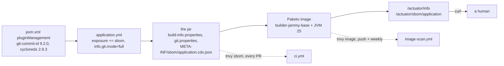

# Step 32 — Know what you ship

## What it is

`GET /actuator/info` on all eight ports (8080-8087, ops token) answers the same commit — `git.commit.id.full` == `8808b643a37a45ae581d5b61e0a1fe3c3f139a22`, `git.dirty` `"false"`, `build.version` `1.0.0-SNAPSHOT`, `java.version` `25.0.4` — the check that matters, `.git.commit.id.full == $(git rev-parse HEAD)`, comes back true on the fleet, not just one pod. Getting there needed one detour: R1's nine-Deployment `rollout restart` fired at once, briefly starved Postgres (`FATAL: sorry, too many clients already`) and left `issuer-service` (one of two replicas) and `settlement-service` (both) answering `/actuator/info` with `{}` — the app came up fine, but that one endpoint's contributors never populated. A second, quieter `rollout restart` on just those two Deployments cleared it; nothing here is step 32's code, just what happens when every actuator-carrying pod restarts on the same Postgres at once.

## Are we affected?

`GET /actuator/sbom` answers `{"ids": ["application"]}` on every port; `GET /actuator/sbom/application` carries 119-177 components depending on the service (notification's slimmer dependency tree at 119, ledger's widest at 177), one `postgresql` component each, and `tomcat-embed-core` `11.0.26` on all eight — the fix landed in the actual running jars, not just the ones built locally. 8080's SBOM saved and re-scanned: `trivy sbom --quiet --severity CRITICAL --exit-code 1 --ignore-unfixed` → **0 findings, exit 0** (P2's pre-fix run on the same shape was exit 1).

## The scanner, before and after

G1's `trivy image` against the step-31 images: `tomcat-embed-core` 11.0.24, three CRITICAL CVEs (2026-65182, -65905, -68525), fixed in 11.0.25 — Boot 4.1.1 pins 11.0.24, no Boot 4.1.2 to pull it in yet. Fix: root `<tomcat.version>11.0.26</tomcat.version>`, one property, all eight services.

`trivy image --quiet --severity CRITICAL --exit-code 1 --ignore-unfixed` on all eight running images: eight zeros. `account-service` and `risk-service` (G1's two baselines) re-profiled at `HIGH,CRITICAL`: ubuntu 22.04 layer still 0, Java jar layer **6 CRITICAL -> 0** — the three `tomcat-embed-core` CVEs are gone, nothing else surfaced in their place.

The fix sits in the pom, not the builder: bumping a Paketo buildpack version wouldn't touch the jar layer this CVE lives in — `tomcat-embed-core` ships inside `BOOT-INF/lib`, picked by Maven's dependency resolution, not by the buildpack that lays down the JRE and OS.

## Two gates

`ci.yml` scans what each service already serves — the SBOM in its own `target/`, in seconds, on every PR. `image-scan.yml` scans the built image itself — OS layer included — on push to main and every Monday, because that's slower (a real `spring-boot:build-image`) and doesn't need to block a PR that never touched a dependency.

## One tag, two images

One `scripts/build-images.sh` run — `mvnw -T1C install -DskipTests` across the reactor then `spring-boot:build-image` for all eight services — took roughly 15-18 minutes wall clock on this host (the `time` builtin's own report doesn't survive `detach.sh`'s WMI launch, so this is bracketed from the log's own timestamps, not a clean `real`). No `-T1C` race hit this run: every jar's `build-info.properties`, `git.properties` and SBOM were all present on the first pass.

`postgres:17` and `redis:7-alpine` moved upstream between whenever this host last pulled them and today — the host's Docker Desktop holds one digest, the kind cluster's containerd holds another, both honestly answering to the same tag. `docker compose up` and `kubectl apply` would each start a different Postgres without the pin in `.local/work/g-pins.md`.

## The bot

`.github/dependabot.yml`: four ecosystems (`maven`, `github-actions`, `docker-compose`, `docker`), maven grouped so a Spring Boot bump doesn't arrive as fifteen separate PRs. Pushing the file ran it at once: eleven PRs inside two minutes — Keycloak 26.3 -> 26.7, Redpanda v25.2.1 -> v26.2.3 and otel-lgtm 0.33.0 -> 0.33.1, each twice (once for `/infra/compose`, once for `/k8s/infra`, the price of pinning in two places), `actions/checkout` 4 -> 7, `actions/setup-java` 4 -> 6, onnxruntime 1.22.0 -> 1.30.0, the OTel logback appender 2.28.0-alpha -> 2.31.1-alpha, ArchUnit 1.4.1 -> 1.5.0. Nothing for Postgres or Redis: the pinned digest is still what `17` and `7-alpine` point at. Nothing for Spring or Tomcat either — Boot 4.1.1 is the newest there is, and `tomcat.version` 11.0.26 is already Tomcat's latest. Two of the four jobs ended red with every PR still opened: the compose and manifest scans also asked Docker Hub for `ledgerflow/*-service`, images that are only ever built on this machine, and got `UNAUTHORIZED`; both entries now ignore `ledgerflow/*`. None of the eleven is merged here — each one is a CI run and a decision, which is the point.

## Where the cost is

`perf/bench.sh step32` against step 31's rows: transfer p50/p95 flat (7->6ms, 12->11ms) but p99 **28ms -> 98ms**; holds cold p99 4422ms, resolved to **17ms** on the required warm rerun (`holds-warm32`, matching step 31's 18ms); payments p99 22ms -> 18ms; settled p50/p99 260/472ms -> 265/449ms. `perf/compare.sh docs/perf/transfer-step31.json docs/perf/transfer-step32.json 10` exits **1** (+244% on p99) — flagged, but p50/p95 didn't move and 98ms is nowhere near a request budget this project enforces; read as tail noise on a shared host the same way step 26's 22->51ms swing was, not a Tomcat-11.0.26 regression (the CVE fix touches nothing in the connector's threading or buffer sizing). Transfer's `failed=3.46%` is the same shape as step 31's 3.5% — k6 counts the scenario's expected 422 (`InsufficientFundsException`) responses as failures by default; the load's wallet balances didn't change between steps, only Tomcat did. The transfer row's `http_req_failed` of 3.46% is not new either, and not Tomcat: all of it is 422 insufficient-funds from wallets step 31's `scenario-fraud-flagged.sh` emptied after its own bench (2 x 5,000 captured from each wallet in its rotation, nothing refunded since) — the k6 check counts a refusal as a pass, k6's failure rate counts any 4xx.

## Kept / Not kept

Kept: `management.info.git.mode: full` (dirty flag included — a build stamped from an uncommitted tree should say so), the SBOM as the CI gate's input instead of a fresh `trivy fs` scan (one artifact, two consumers), one image scanned for all eight (identical base layers).

Not kept: SBOM signing or attestation, `trivy fs`, a `.trivyignore`, bumping Boot itself (only the property the scanner actually named), Helm, an ADR for this step. The pins and the bot are the versioning story; nothing here manages a release.
