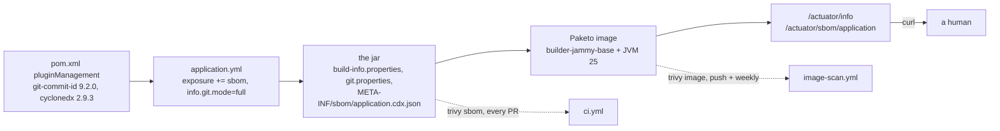

# Step 32 — Know what you ship

## What it is

{{R: info}}

## Are we affected?

{{R: sbom}}

## The scanner, before and after

G1's `trivy image` against the step-31 images: `tomcat-embed-core` 11.0.24, three CRITICAL CVEs (2026-65182, -65905, -68525), fixed in 11.0.25 — Boot 4.1.1 pins 11.0.24, no Boot 4.1.2 to pull it in yet. Fix: root `<tomcat.version>11.0.26</tomcat.version>`, one property, all eight services.

{{R: scan after}}

The fix sits in the pom, not the builder: bumping a Paketo buildpack version wouldn't touch the jar layer this CVE lives in — `tomcat-embed-core` ships inside `BOOT-INF/lib`, picked by Maven's dependency resolution, not by the buildpack that lays down the JRE and OS.

## Two gates

`ci.yml` scans what each service already serves — the SBOM in its own `target/`, in seconds, on every PR. `image-scan.yml` scans the built image itself — OS layer included — on push to main and every Monday, because that's slower (a real `spring-boot:build-image`) and doesn't need to block a PR that never touched a dependency.

## One tag, two images

{{R: build time}}

`postgres:17` and `redis:7-alpine` moved upstream between whenever this host last pulled them and today — the host's Docker Desktop holds one digest, the kind cluster's containerd holds another, both honestly answering to the same tag. `docker compose up` and `kubectl apply` would each start a different Postgres without the pin in `.local/work/g-pins.md`.

## The bot

`.github/dependabot.yml`: four ecosystems (`maven`, `github-actions`, `docker-compose`, `docker`), maven grouped so a Spring Boot bump doesn't arrive as fifteen separate PRs. {{C: PRs}}

## Where the cost is

{{R: bench}}

## Kept / Not kept

Kept: `management.info.git.mode: full` (dirty flag included — a build stamped from an uncommitted tree should say so), the SBOM as the CI gate's input instead of a fresh `trivy fs` scan (one artifact, two consumers), one image scanned for all eight (identical base layers).

Not kept: SBOM signing or attestation, `trivy fs`, a `.trivyignore`, bumping Boot itself (only the property the scanner actually named), Helm, an ADR for this step. The pins and the bot are the versioning story; nothing here manages a release.
