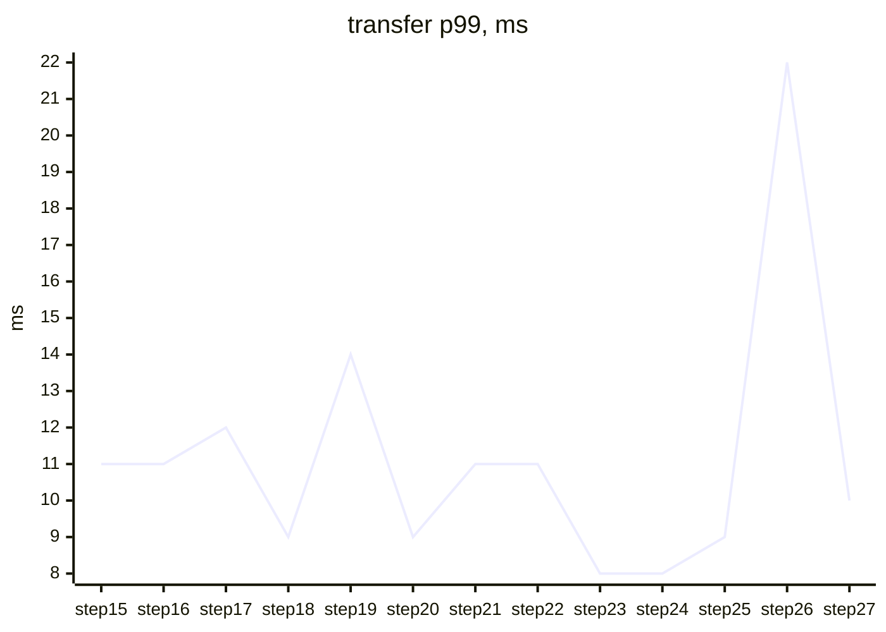
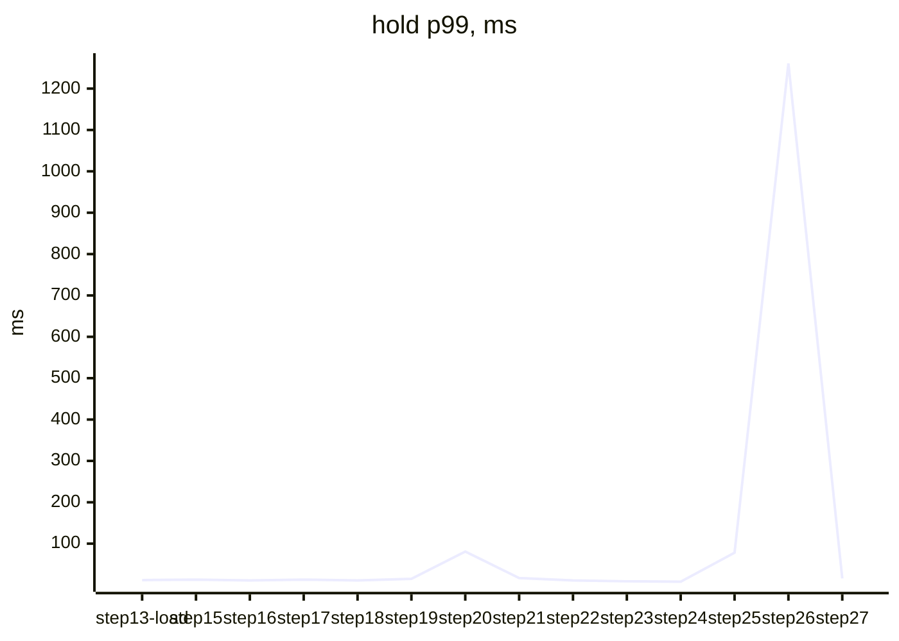
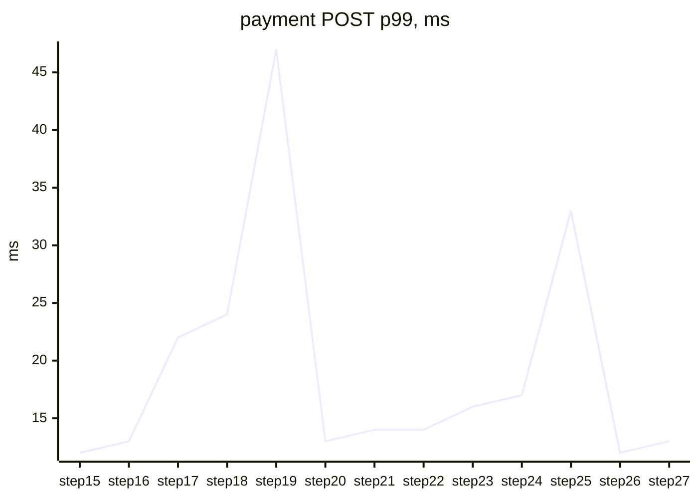
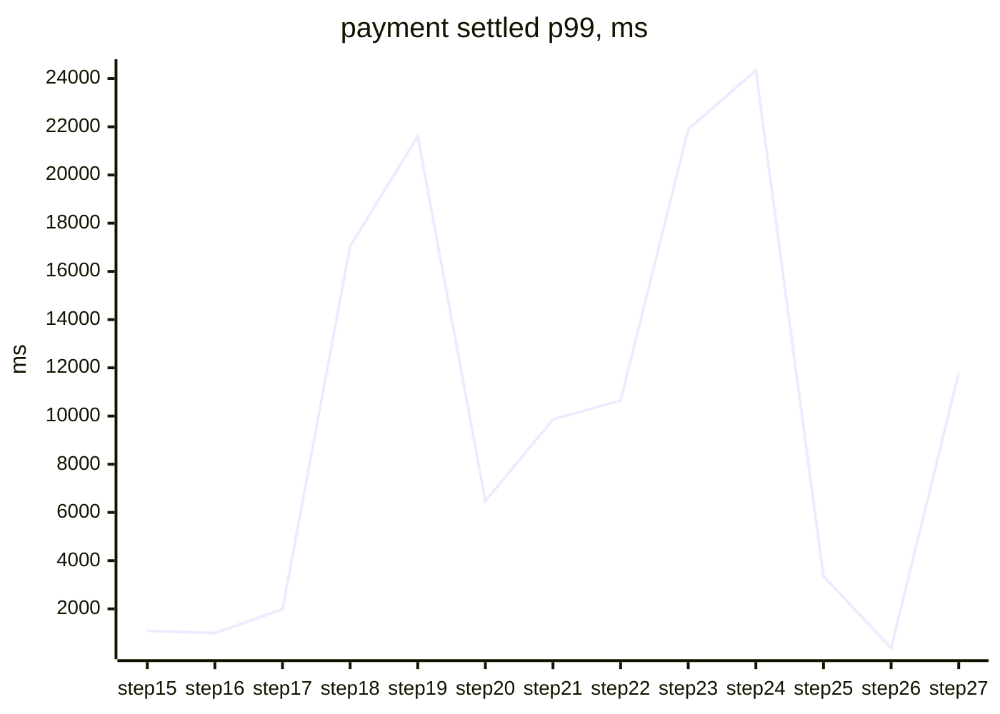

# Performance history

Every file here is one k6 run, written by `perf/run.sh` and stamped with the commit it measured (`.meta`).
`perf/bench.sh stepNN` runs the fixed suite at the end of every step, so the `step*` rows are comparable
across the whole build; the other rows are one-off experiments. `perf/compare.sh a.json b.json` diffs any two.
Open model (k6 constant arrival rate), one machine, Postgres and Redpanda in Docker, services as local JVMs.
Rows before step 15 were measured with the JIT pinned at C1 (Boot's `spring-boot:run` default); from step 15 the services run with C2.
Generated by `perf/history.sh`; do not edit.

## Transfer: `POST /api/v1/transfers`, one service, one transaction

| date | commit | label | load | p50 ms | p95 ms | p99 ms | failed |
|---|---|---|---|---:|---:|---:|---:|
| 2026-09-14 | `9dcd6f3` | baseline | 100/s for 60s | 5 | 7 | 8 | 0% |
| 2026-09-14 | `d3c577f` | materialised | 100/s for 60s | 5 | 7 | 8 | 0% |
| 2026-09-15 | `3237c3a-dirty` | step15 | 100/s for 60s | 7 | 9 | 11 | 0% |
| 2026-09-15 | `bb0c0d9-dirty` | step16 | 100/s for 60s | 7 | 9 | 11 | 0% |
| 2026-09-15 | `f2bef6f-dirty` | step17 | 100/s for 60s | 8 | 10 | 12 | 0% |
| 2026-09-15 | `d1b1c41-dirty` | step18 | 100/s for 60s | 6 | 8 | 9 | 0% |
| 2026-09-15 | `e96280c-dirty` | step19 | 100/s for 60s | 9 | 12 | 14 | 0% |
| 2026-09-15 | `a3d0d89-dirty` | step20 | 100/s for 60s | 6 | 8 | 9 | 0% |
| 2026-09-15 | `910d07c-dirty` | step21 | 100/s for 60s | 7 | 9 | 11 | 0% |
| 2026-09-16 | `59a084b` | step22 | 100/s for 60s | 6 | 9 | 11 | 0% |
| 2026-09-16 | `ae637ce-dirty` | step23 | 100/s for 60s | 6 | 7 | 8 | 0% |
| 2026-09-16 | `38438bd-dirty` | step24 | 100/s for 60s | 6 | 7 | 8 | 0% |
| 2026-09-16 | `36472e4-dirty` | step25 | 100/s for 60s | 4 | 6 | 9 | 4.31% |
| 2026-09-16 | `f99f918-dirty` | step26 | 100/s for 60s | 4 | 7 | 22 | 0% |
| 2026-09-16 | `2b135da` | step27 | 100/s for 60s | 6 | 9 | 10 | 0% |

## Hold: `POST /api/v1/holds`, ledger asks account first

| date | commit | label | load | p50 ms | p95 ms | p99 ms | failed |
|---|---|---|---|---:|---:|---:|---:|
| 2026-09-14 | `3a2fbe1` | baseline | 50/s for 30s | 7 | 10 | 15 | 0% |
| 2026-09-14 | `3a2fbe1` | frozen-no-timeout | 50/s for 30s | 30003 | 30004 | 30008 | 100% |
| 2026-09-14 | `3a2fbe1` | frozen-timeout-fallback | 50/s for 30s | 5 | 807 | 809 | 0% |
| 2026-09-14 | `3a2fbe1` | frozen-retry-fallback | 50/s for 30s | 407 | 415 | 2012 | 0% |
| 2026-09-15 | `3d4a15d` | step13-load | 50/s for 60s | 7 | 10 | 12 | 0% |
| 2026-09-15 | `3237c3a-dirty` | step15 | 50/s for 30s | 8 | 11 | 13 | 0% |
| 2026-09-15 | `bb0c0d9-dirty` | step16 | 50/s for 30s | 7 | 9 | 11 | 0% |
| 2026-09-15 | `f2bef6f-dirty` | step17 | 50/s for 30s | 8 | 11 | 13 | 0% |
| 2026-09-15 | `d1b1c41-dirty` | step18 | 50/s for 30s | 7 | 9 | 11 | 0% |
| 2026-09-15 | `e96280c-dirty` | step19 | 50/s for 30s | 9 | 12 | 15 | 0% |
| 2026-09-15 | `a3d0d89-dirty` | step20 | 50/s for 30s | 8 | 21 | 81 | 0% |
| 2026-09-15 | `910d07c-dirty` | step21 | 50/s for 30s | 9 | 13 | 17 | 0% |
| 2026-09-16 | `59a084b` | step22 | 50/s for 30s | 7 | 10 | 11 | 0% |
| 2026-09-16 | `ae637ce-dirty` | step23 | 50/s for 30s | 6 | 8 | 9 | 0% |
| 2026-09-16 | `38438bd-dirty` | step24 | 50/s for 30s | 6 | 8 | 8 | 0% |
| 2026-09-16 | `36472e4-dirty` | step25 | 50/s for 30s | 7 | 14 | 78 | 0% |
| 2026-09-16 | `f99f918-dirty` | step26 | 50/s for 30s | 9 | 64 | 1261 | 0% |
| 2026-09-16 | `f99f918-dirty` | warm26 | 50/s for 30s | 7 | 10 | 12 | 0% |
| 2026-09-16 | `2b135da` | step27 | 50/s for 30s | 8 | 12 | 16 | 0% |

## Payment: `POST /api/v1/payments`, the saga across four services

The POST answers 202 at once; `settled` is the time until the saga row is Captured or Failed, read from the database (`perf/settled.sh`).

| date | commit | label | load | POST p50 | POST p99 | settled p50 | settled p99 | captured | failed |
|---|---|---|---|---:|---:|---:|---:|---:|---:|
| 2026-09-15 | `3237c3a-dirty` | baseline-200 | 200/s for 180s | 4 | 7 | 15909 | 34734 | 792 | 35216 |
| 2026-09-15 | `3237c3a-dirty` | outbox-drains-200 | 200/s for 180s | 5 | 13 | 16064 | 41745 | 4386 | 31623 |
| 2026-09-15 | `3237c3a-dirty` | baseline | 100/s for 180s | 5 | 10 | 15750 | 41478 | 2101 | 15909 |
| 2026-09-15 | `3237c3a-dirty` | outbox-drains | 100/s for 180s | 6 | 13 | 2770 | 29351 | 18009 | 0 |
| 2026-09-15 | `3237c3a-dirty` | acks-per-poll | 100/s for 180s | 7 | 15 | 2667 | 3663 | 18011 | 0 |
| 2026-09-15 | `3237c3a-dirty` | outbox-tick-50ms | 100/s for 180s | 5 | 12 | 378 | 1452 | 18009 | 0 |
| 2026-09-15 | `3237c3a-dirty` | outbox-wakes | 100/s for 180s | 6 | 14 | 234 | 1359 | 18010 | 0 |
| 2026-09-15 | `3237c3a-dirty` | wal-4gb-lz4 | 100/s for 180s | 6 | 21 | 411 | 1298 | 18009 | 0 |
| 2026-09-15 | `3237c3a-dirty` | outbox-deletes | 100/s for 180s | 7 | 16 | 564 | 1428 | 18009 | 0 |
| 2026-09-15 | `3237c3a-dirty` | sync-commit-off | 100/s for 180s | 2 | 4 | 300 | 390 | 18008 | 0 |
| 2026-09-15 | `3237c3a-dirty` | async-mark | 100/s for 180s | 6 | 16 | 543 | 1392 | 18009 | 0 |
| 2026-09-15 | `3237c3a-dirty` | sampling-5pct | 100/s for 180s | 6 | 13 | 462 | 1813 | 18008 | 0 |
| 2026-09-15 | `3237c3a-dirty` | virtual-threads | 100/s for 180s | 6 | 196 | 417 | 5335 | 18009 | 0 |
| 2026-09-15 | `3237c3a-dirty` | step15 | 100/s for 180s | 5 | 12 | 367 | 1088 | 18007 | 0 |
| 2026-09-15 | `3237c3a-dirty` | tuned-200 | 200/s for 180s | 5 | 15 | 17717 | 44996 | 13205 | 22803 |
| 2026-09-15 | `3237c3a-dirty` | tuned-150 | 150/s for 180s | 5 | 14 | 6791 | 39299 | 22725 | 4284 |
| 2026-09-15 | `bb0c0d9-dirty` | step16 | 100/s for 180s | 6 | 13 | 391 | 996 | 18008 | 0 |
| 2026-09-15 | `bb0c0d9-dirty` | risk-on | 100/s for 180s | 6 | 15 | 412 | 2261 | 18008 | 0 |
| 2026-09-15 | `bb0c0d9-dirty` | ab-off-1 | 100/s for 180s | 6 | 13 | 396 | 1241 | 18007 | 0 |
| 2026-09-15 | `bb0c0d9-dirty` | ab-on-1 | 100/s for 180s | 6 | 13 | 414 | 1305 | 18008 | 0 |
| 2026-09-15 | `bb0c0d9-dirty` | ab-off-2 | 100/s for 180s | 7 | 15 | 447 | 1847 | 18008 | 0 |
| 2026-09-15 | `bb0c0d9-dirty` | ab-on-2 | 100/s for 180s | 6 | 13 | 410 | 1009 | 18007 | 0 |
| 2026-09-15 | `f2bef6f-dirty` | step17 | 100/s for 180s | 6 | 22 | 418 | 1982 | 18009 | 0 |
| 2026-09-15 | `d1b1c41-dirty` | step18 | 100/s for 180s | 6 | 24 | 528 | 17042 | 18009 | 0 |
| 2026-09-15 | `ca974d1-dirty` | step19 | 100/s for 180s | 6 | 47 | 428 | 21606 | 18010 | 0 |
| 2026-09-15 | `a3d0d89-dirty` | step20 | 100/s for 180s | 6 | 13 | 437 | 6472 | 18010 | 0 |
| 2026-09-15 | `910d07c-dirty` | step21 | 100/s for 180s | 6 | 14 | 438 | 9862 | 18009 | 0 |
| 2026-09-16 | `59a084b` | step22 | 100/s for 180s | 6 | 14 | 431 | 10643 | 18006 | 0 |
| 2026-09-16 | `ae637ce-dirty` | step23 | 100/s for 180s | 6 | 16 | 527 | 21902 | 18004 | 0 |
| 2026-09-16 | `38438bd-dirty` | step24 | 100/s for 180s | 7 | 17 | 908 | 24332 | 18005 | 0 |
| 2026-09-16 | `36472e4-dirty` | step25 | 100/s for 180s | 5 | 33 | 316 | 3351 | 18005 | 0 |
| 2026-09-16 | `f99f918-dirty` | step26 | 100/s for 180s | 5 | 12 | 243 | 378 | 18005 | 0 |
| 2026-09-16 | `2b135da` | step27 | 100/s for 180s | 6 | 13 | 414 | 11782 | 18006 | 0 |

Hosts: AMD Ryzen 9 9950X 16-Core Processor, 32 threads.
